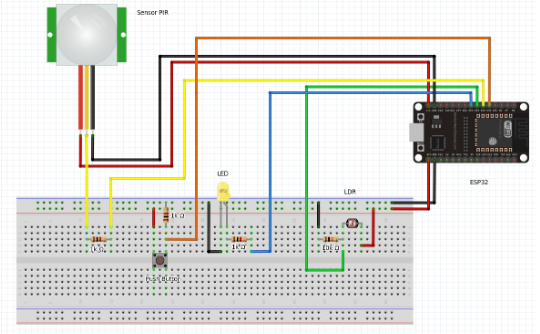

# Smartlight ESP32

> Implementation of an intelligent lamp (LED) that automatically adjusts the light intensity according to the ambient brightness

 
## Prerequisites

Before you begin, make sure you've met the following requirements:
* [Arduino IDE](https://www.arduino.cc/en/software/)
* [ESP32 Package](https://dl.espressif.com/dl/package_esp32_index.json)

## Collaborators
This project was built with collaborators:
<table>
  <tr>
    <td align="center">
      <a href="#">
         
        
          <b>Gabriel Burich</b>
        
      </a>
    </td>
    <td align="center">
      <a href="#">
         
        
          <b>Douglas Martins</b>
        
      </a>
    </td>
  </tr>
</table>

 